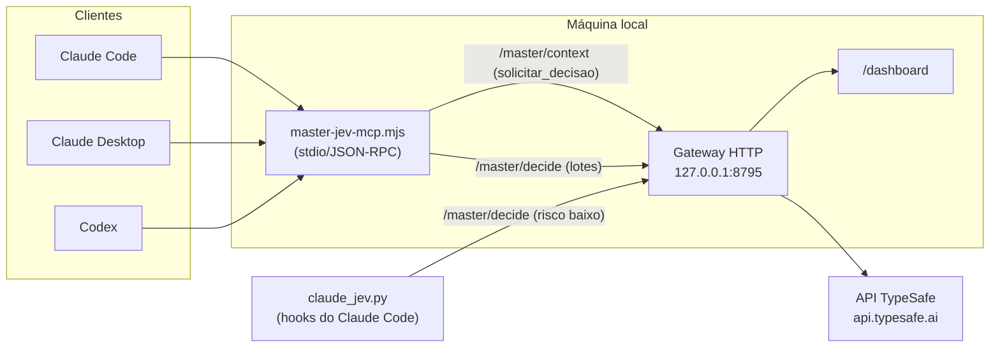

# Master-JEV Hook

## O que é

O Master-JEV Hook é um serviço local que conecta o Claude Code, o Claude
Desktop e o Codex ao JEV, o motor de decisão da TypeSafe, por um servidor MCP
(`master-jev-hook`). Em vez de o agente decidir sozinho entre alternativas
explícitas — qual abordagem seguir, qual fonte usar, qual próxima ação tomar,
como classificar ou pontuar um lote de itens — ele delega a escolha ao JEV por
um conjunto de ferramentas MCP, e o gateway registra cada consulta num painel
local.

O pacote tem três peças: o gateway HTTP local (`gateway/`, em TypeScript/Node),
que fala com a API da TypeSafe; o adaptador MCP stdio
(`gateway/bin/master-jev-mcp.mjs`), registrado como servidor `master-jev-hook`
nos clientes suportados; e, só no Claude Code, um conjunto de hooks
(`claude_jev.py`) que injeta a regra de orquestração na sessão, avisa quando o
JEV é consultado e faz verificações pontuais (comando arriscado no Bash,
conclusão sem verificação, o que preservar numa compactação), sempre sem
travar a sessão.

O JEV decide entre opções que o agente já levantou: ele não gera texto, não
prova fatos por conta própria e não concede permissões. Registrar o servidor
MCP também não muda o endpoint de inferência do modelo — é uma ferramenta a
mais que o agente pode chamar, e os hooks apenas reforçam quando chamá-la.

## Como funciona



O cliente chama uma ferramenta MCP; o adaptador `master-jev-mcp.mjs` traduz a
chamada em uma requisição HTTP ao gateway local; o gateway monta a pergunta
para o JEV (Choice, Score ou Noul), consulta a API da TypeSafe e devolve o
resultado. O adaptador MCP não guarda a chave da API — ela fica só no ambiente
do gateway.

### Ferramentas MCP

| Ferramenta | Rota | Pergunta ao JEV | Uso |
| --- | --- | --- | --- |
| `solicitar_decisao` | `/master/context` | Montada pelo gateway (objetivo + contexto com candidatos, critério, evidência, risco) | Escolha de abordagem, fonte ou próxima ação |
| `jev_classificar` | `/master/decide` | Uma Choice por item (até 32; 2 a 64 categorias) | Rotular itens em lote |
| `jev_verificar` | `/master/decide` | Noul (probabilidade de sim) | Checar se um trecho satisfaz uma condição |
| `jev_pontuar` | `/master/decide` | Uma Score por critério, com pesos opcionais | Pontuar risco, qualidade ou urgência |
| `jev_ranquear` | `/master/decide` | Uma Score por candidato, com ranking | Triar itens antes de ler tudo |

### Limiares de confiança por risco

Cada consulta informa o risco da ação (`risco`/`risk`); o gateway exige uma
confiança mínima em respostas do tipo Choice ou Score:

| Risco | Confiança mínima | Quando usar |
| --- | --- | --- |
| baixo (padrão) | 0.65 | Leitura, triagem, ordem de investigação |
| médio | 0.80 | Mudança reversível, escolha de abordagem |
| alto | 0.90 | Ação irreversível, externa, de segurança ou com credenciais |

Abaixo do limiar, ou em caso de erro, o gateway abstém — a resposta não é
usada e o cliente segue com a alternativa local, sem repetir a decisão. Noul
(usado por `jev_verificar`) é uma probabilidade de "sim", não uma confiança, e
tem limiar próprio. Nenhum resultado do JEV prova fatos nem concede permissões
por si só.

### Hooks do Claude Code

Todos os hooks são fail-open: erro, timeout, abstenção do JEV ou confiança
abaixo do limiar nunca bloqueiam a sessão.

| Evento | O que faz |
| --- | --- |
| `SessionStart` | Injeta a regra de orquestração na sessão, se ainda não estiver no `CLAUDE.md`; após compactação, reinjeta o que o JEV marcou como relevante |
| `UserPromptSubmit` | Lembrete curto da regra a cada mensagem |
| `PreToolUse` (ferramentas do gateway) | Avisa antes de cada consulta ao JEV |
| `PostToolUse` (ferramentas do gateway) | Avisa o resultado da consulta |
| `PreToolUse` (Bash) | Se um filtro local achar o comando arriscado, pergunta ao JEV se é rotina, precisa de confirmação ou é destrutivo; nunca decide sozinho entre permitir e negar |
| `Stop` | Se houve edição sem verificação depois, pergunta ao JEV; alerta o agente, no máximo três vezes por sessão |
| `PreCompact` | Pergunta ao JEV, mensagem a mensagem, o que vale a pena preservar antes de compactar |
| `PostToolUse` (todas as ferramentas) | A cada 15 ferramentas, pergunta ao JEV se a sessão segue no rumo, travou ou saiu do escopo |

### Painel

O painel local, em `http://127.0.0.1:8795/dashboard`, lista as chamadas ao
JEV: rota, tokens informados, latência, decisão, pergunta e resultado
sanitizado. Toda consulta feita pelo MCP e pelos hooks aparece ali. Sem a
variável `JEV_LOG_FILE`, o histórico fica só em memória e se perde a cada
reinício do gateway.

## Pré-requisitos

- Linux ou macOS. Windows nativo precisa de Python 3.13+ (o instalador usa
  `os.fchmod`); a alternativa mais simples é rodar tudo dentro do WSL2, já que
  o build do gateway usa `rm`/`cp` no estilo POSIX.
- Node.js 22.15 ou mais recente, com caminho absoluto acessível ao cliente que
  vai rodar o MCP.
- pnpm 10.33.3 (definido em `gateway/package.json`). Sem pnpm instalado
  globalmente, use `npm exec --yes --package=pnpm@10.33.3 -- pnpm <comando>`.
- Python 3.11 ou mais recente, só com a biblioteca padrão.
- Uma chave própria da API da TypeSafe.
- Claude Code, Claude Desktop e/ou Codex já instalados nos alvos desejados.

## Instalação

### 1. Clonar o repositório

```bash
git clone https://github.com/sophia-phillipa/master-jev-hook.git
```

### 2. Construir o gateway

```bash
cd master-jev-hook/gateway
```

```bash
pnpm install --frozen-lockfile --ignore-scripts
```

```bash
pnpm typecheck
```

```bash
pnpm build
```

Isso gera `gateway/dist/` a partir do código em `gateway/src/`. Nenhum desses
comandos consulta a API da TypeSafe.

### 3. Criar o arquivo de ambiente privado

O arquivo com a chave fica fora do repositório, em modo 600:

```bash
cd ..
```

```bash
umask 077; mkdir -p ~/.config/master-jev-hook ~/.local/state/master-jev-hook
```

```bash
umask 077; set -C; cp deploy/gateway.env.example ~/.config/master-jev-hook/gateway.env
```

```bash
chmod 600 ~/.config/master-jev-hook/gateway.env
```

Edite `~/.config/master-jev-hook/gateway.env` para preencher
`TYPESAFE_API_KEY` e o caminho absoluto de `JEV_LOG_FILE` (nunca cole a chave
no chat, no histórico do shell ou num commit). O gateway lê esse arquivo com
`node --env-file`, então não use `source` nele.

Principais variáveis (veja `deploy/gateway.env.example` para a lista
completa):

| Variável | Padrão | Função |
| --- | --- | --- |
| `TYPESAFE_API_KEY` | (obrigatória) | Chave da API da TypeSafe |
| `HOST` | `127.0.0.1` | Interface do gateway (loopback por padrão) |
| `PORT` | `8795` | Porta HTTP do gateway e do painel |
| `JEV_MODEL` | `jev-latest` | Modelo do JEV (padrão do código para o provedor TypeSafe; `deploy/gateway.env.example` fixa `jev-1.13.0`) |
| `JEV_MIN_CONFIDENCE` | `0.65` | Confiança mínima do risco baixo |
| `JEV_MIN_CONFIDENCE_MEDIUM` | `0.80` | Confiança mínima do risco médio |
| `JEV_MIN_CONFIDENCE_HIGH` | `0.90` | Confiança mínima do risco alto |
| `JEV_DIRECT_CALLS` | `false` | Responder sem chamar o JEV quando os argumentos já são certos |
| `JEV_CONTEXT_ROUTING` | `true` | Habilita a rota `/master/context` |
| `JEV_INSPECT_INPUTS` | `false` | Guarda cópias locais das entradas enviadas ao JEV (pode conter dados privados) |
| `JEV_LOG_FILE` | (vazio) | Caminho absoluto do log; sem ele, o histórico do painel não sobrevive a um reinício |

### 4. Subir o gateway como serviço systemd de usuário (Linux)

Copie o modelo de serviço, substituindo `@REPO@` pelo caminho absoluto do
checkout e `@NODE@` pelo caminho absoluto do Node (`readlink -f "$(command -v node)"`):

```bash
mkdir -p ~/.config/systemd/user
```

```bash
sed -e "s|@REPO@|$(pwd)|" -e "s|@NODE@|$(readlink -f "$(command -v node)")|" deploy/master-jev-hook.service > ~/.config/systemd/user/master-jev-hook.service
```

```bash
systemctl --user daemon-reload
```

```bash
systemctl --user enable --now master-jev-hook.service
```

```bash
curl -s http://127.0.0.1:8795/health
```

Em macOS, use um `LaunchAgent` equivalente (não coberto por este repositório).
Se a porta `8795` já estiver em uso, escolha outra livre e atualize junto o
serviço (`PORT` no `gateway.env`), o instalador (`--gateway-url`) e qualquer
hook já configurado. `scripts/verificar.sh` não usa mais uma porta fixa: ele lê
a URL gravada pelo instalador em `PREFIX/claude_jev.json` (campo `gateway_url`,
`PREFIX` com o mesmo padrão `~/.local/share/master-jev-hook`), a menos que a
variável de ambiente `MASTER_JEV_GATEWAY_URL` esteja definida, que tem
prioridade sobre o arquivo.

### 5. Instalar nos clientes

```bash
python3 install.py --dry-run
```

O `--dry-run` mostra o plano sem escrever nada. Depois de conferir:

```bash
python3 install.py --target all
```

`--target` aceita `claude-code`, `claude-desktop`, `codex` ou `all` (padrão).
Com `all`, um cliente ausente é pulado com aviso; um alvo explícito instala
mesmo assim. Outras opções úteis: `--node`, `--gateway-url`, `--claude-home`,
`--code-config`, `--desktop-config`, `--codex-home`, `--prefix` (padrão
`~/.local/share/master-jev-hook`). O plano inteiro é validado antes de
qualquer escrita; a instalação é idempotente e faz backup do que substitui.

Com a variável de ambiente `CLAUDE_CONFIG_DIR` definida, `install.py` grava
`settings.json`, `CLAUDE.md`, `skills/` e `.claude.json` diretamente em
`$CLAUDE_CONFIG_DIR` (inclusive como padrão de `--claude-home`), em vez de
`~/.claude` e `~/.claude.json`.

Depois de instalar, reinicie os clientes — sessões já abertas não recebem as
instruções novas. No Claude Code, `/mcp` lista o servidor `master-jev-hook`
e `/hooks` mostra os hooks instalados.

### 6. Verificar, sem custo

```bash
scripts/verificar.sh
```

O script confere o gateway, os arquivos instalados e a configuração de cada
cliente presente, sem fazer nenhuma consulta paga à API.

### 7. Abrir o painel

```bash
curl -s http://127.0.0.1:8795/dashboard > /dev/null && echo "painel em http://127.0.0.1:8795/dashboard"
```

Ou abra `http://127.0.0.1:8795/dashboard` diretamente no navegador.

## Claude Desktop (modo Chat)

No modo Chat, o Claude Desktop enxerga o servidor MCP, mas não lê o
`CLAUDE.md` nem roda os hooks do Claude Code. Para o mesmo nível de instrução
nesse modo, o instalador gera dois arquivos no prefixo de instalação:

- `master-jev-hook-claude-chat.md`: instruções equivalentes às do Claude Code,
  em texto simples, para colar como instrução do app ou do projeto.
- `master-jev-hook-skill.zip`: a skill `master-jev-hook` empacotada, para subir em
  Configurações → Capabilities → Skills.

## Codex

O `install.py` escreve, entre marcadores gerenciados, dois blocos:

- Em `$CODEX_HOME/config.toml`, entre `# master-jev-hook:begin` e
  `# master-jev-hook:end`: a seção `[mcp_servers.master-jev-hook]`, com o
  comando do Node, o caminho do adaptador e `MASTER_JEV_GATEWAY_URL` no
  ambiente.
- Em `$CODEX_HOME/AGENTS.md`, entre `<!-- master-jev-hook:begin -->` e
  `<!-- master-jev-hook:end -->`: a regra de orquestração para o Codex.

`$CODEX_HOME` segue a variável de ambiente `CODEX_HOME`, com `~/.codex` como
padrão.

## Modo proxy opcional

Além de responder às ferramentas MCP e aos hooks, o mesmo gateway pode atuar
como proxy do tráfego de LLM dos lançadores `gateway/bin` (`master-jev-codex`,
`master-jev-claude`, `master-jev-gemini`, `master-jev-opencode`): cada um sobe
um gateway local e aponta o cliente para ele, que roteia a escolha de
ferramentas pelo JEV e encaminha o resto do pedido ao provedor real. É nesse
modo que entram as variáveis `UPSTREAM_BASE_URL`/`UPSTREAM_API_KEY` (e as
específicas de cada lançador, como `JEV_CODEX_UPSTREAM_BASE_URL`) e o campo
`upstream` devolvido por `GET /health`. O uso normal via MCP e hooks (Claude
Code, Claude Desktop, Codex configurados por `install.py`) não depende desse
modo.

## Privacidade e custos

Cada consulta ao JEV — pelas ferramentas MCP ou pelos hooks — é uma chamada
paga à API da TypeSafe. A instalação em si (clonar, construir, rodar
`install.py --dry-run` ou `scripts/verificar.sh`) não faz nenhuma consulta
paga; o custo começa quando um cliente chama de fato uma ferramenta MCP ou um
hook de decisão dispara.

O payload enviado ao JEV contém o objetivo da decisão, os candidatos, o
critério, evidências textuais e o nível de risco informado — nunca a chave da
API, que fica só no processo do gateway. `JEV_INSPECT_INPUTS` e
`JEV_DEBUG_DUMP_DIR`, ambos desligados por padrão, guardam cópias locais das
entradas enviadas para depuração; como podem conter texto livre com dados
privados, mantenha-os desligados fora de investigação pontual. Nunca cole
segredos (chaves, senhas, tokens) em uma pergunta ou contexto enviado ao JEV.

## Desinstalar / restaurar backup

Cada instalação que altera algo grava um backup em
`PREFIX/backups/<timestamp>/`, com o conteúdo anterior de cada arquivo tocado
e um `restore.json` (`backup: null` indica um arquivo criado por aquela
instalação, não um arquivo substituído). Para restaurar, feche os clientes e
copie de volta apenas os destinos desejados a partir desse backup, apagando os
que tinham `backup: null`.

Para desinstalar manualmente (se a instalação usou `CLAUDE_CONFIG_DIR`, troque
`~/.claude` e `~/.claude.json` abaixo por `$CLAUDE_CONFIG_DIR` e
`$CLAUDE_CONFIG_DIR/.claude.json`, respectivamente):

- Remova a entrada `mcpServers.master-jev-hook` de `~/.claude.json` e de
  `claude_desktop_config.json`.
- Remova os hooks cujo comando contém `PREFIX/claude_jev.py` em
  `~/.claude/settings.json`.
- Remova o bloco `master-jev-hook-claude` do `~/.claude/CLAUDE.md` e a pasta
  `~/.claude/skills/master-jev-hook/`.
- Remova o bloco `# master-jev-hook:begin`/`# master-jev-hook:end` de
  `$CODEX_HOME/config.toml` e o bloco `<!-- master-jev-hook:begin -->`/
  `<!-- master-jev-hook:end -->` de `$CODEX_HOME/AGENTS.md`.
- Apague o `PREFIX` (padrão `~/.local/share/master-jev-hook`).

Para o gateway:

```bash
systemctl --user disable --now master-jev-hook.service
```

Depois, se quiser, remova a unit e as pastas
`~/.config/master-jev-hook/` e `~/.local/state/master-jev-hook/`.

## Desenvolvimento

Testes do instalador e dos hooks (Python):

```bash
python3 -m unittest discover -s tests -v
```

Testes e checagem de tipos do gateway (dentro de `gateway/`):

```bash
pnpm typecheck
```

```bash
pnpm test
```

### Testar sem chave (JEV simulado)

`gateway/scripts/mock-jev.mjs` é um substituto local de `POST /v1/systemone`,
para exercitar o gateway de ponta a ponta sem uma chave da TypeSafe. Suba-o
(porta padrão 8799, ajustável com `MOCK_JEV_PORT`):

```bash
node gateway/scripts/mock-jev.mjs
```

Depois, dentro de `gateway/`, aponte um gateway de teste para ele com
`TYPESAFE_BASE_URL` (mantendo `TYPESAFE_API_KEY` como qualquer valor não vazio,
só para passar na validação). Use outra `PORT`, porque o serviço instalado já
ocupa a 8795:

```bash
TYPESAFE_API_KEY=mock TYPESAFE_BASE_URL=http://127.0.0.1:8799 PORT=8899 pnpm dev
```

Para que o MCP e os hooks usem esse gateway de teste, instale apontando para a
mesma porta (de preferência com um `HOME` temporário, para não alterar a sua
instalação real):

```bash
python3 install.py --gateway-url http://127.0.0.1:8899
```

No padrão, o mock responde às perguntas de `solicitar_decisao` com confiança
`0.5` (variável `MOCK_JEV_ARG_CERTAINTY`, padrão `0.5`) — abaixo do limiar
mínimo (`0.65`), então o JEV se abstém e a decisão fica por conta da
alternativa local, como em produção. Para forçar uma escolha, suba o mock com
uma certeza acima do limiar, por exemplo:

```bash
MOCK_JEV_ARG_CERTAINTY=0.9 node gateway/scripts/mock-jev.mjs
```

Outras variáveis do mock: `MOCK_JEV_SCRIPT` (nomes de ferramenta a devolver em
sequência, para roteamento de ferramentas de clientes LLM), `MOCK_JEV_CONFIDENCE`
(confiança da escolha de ferramenta, padrão `0.95`) e `MOCK_JEV_DUMP_DIR`
(grava cada pergunta e resposta em disco, para depuração).

## Licença

Apache License 2.0 — veja [LICENSE](LICENSE) e [NOTICE](NOTICE). Créditos de
terceiros em [THIRD_PARTY_NOTICES.md](THIRD_PARTY_NOTICES.md).
