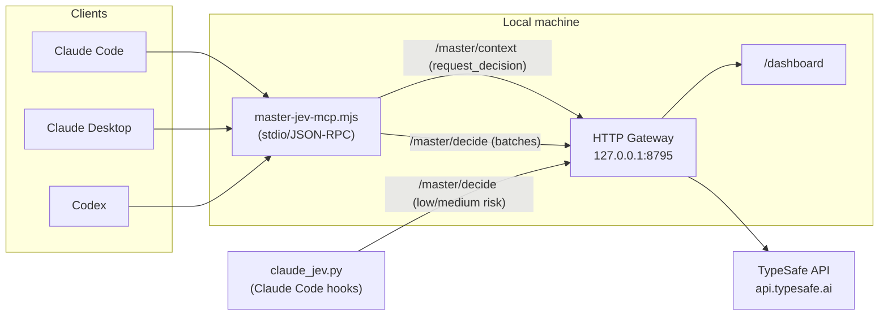
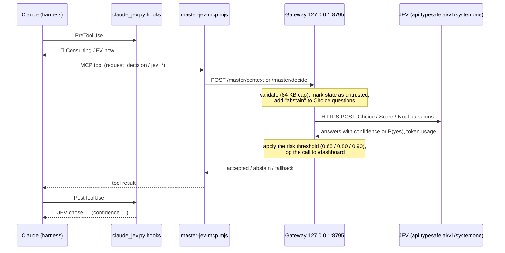
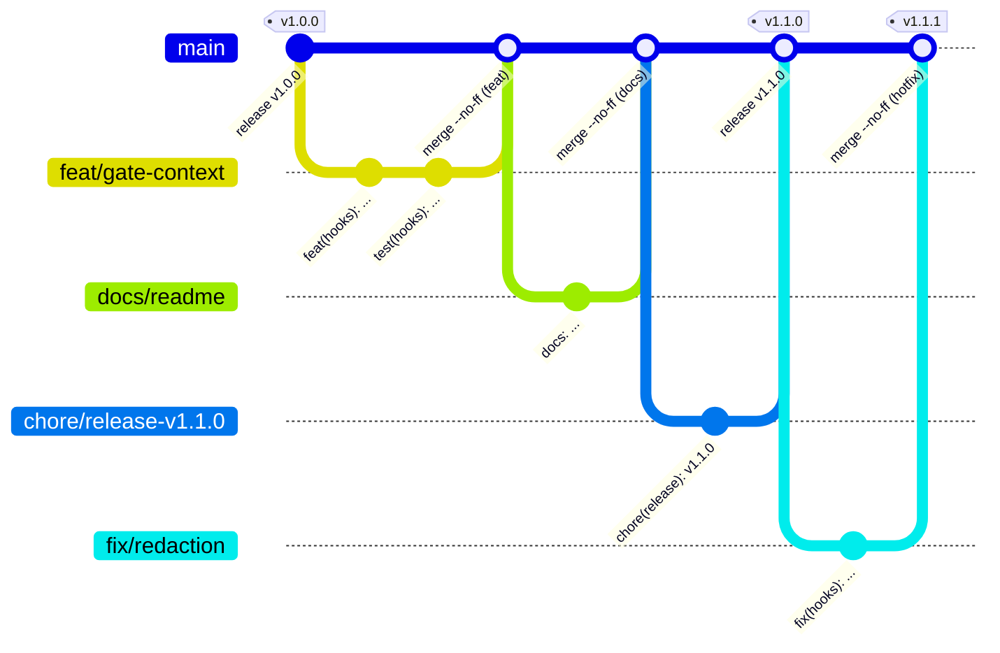

# 🔷 Master-JEV Hook

[](README.md) [-green.svg)](README.pt-BR.md)

## 💡 What it is

Master-JEV Hook is a local service that connects Claude Code, Claude
Desktop and Codex to JEV, TypeSafe's decision engine, through an MCP server
(`master-jev-hook`). Instead of the agent deciding on its own between
explicit alternatives — which approach to follow, which source to use, which
next action to take, how to classify or score a batch of items — it delegates
the choice to JEV through a set of MCP tools, and the gateway logs every
query in a local dashboard.

The package has three pieces: the local HTTP gateway (`gateway/`, in
TypeScript/Node), which talks to the TypeSafe API; the stdio MCP adapter
(`gateway/bin/master-jev-mcp.mjs`), registered as the `master-jev-hook`
server in supported clients; and, only for Claude Code, a set of hooks
(`claude_jev.py`) that injects the orchestration rule into the session,
announces when JEV is queried and performs spot checks (risky Bash command,
completion without verification, what to preserve during a compaction),
always without blocking the session.

The gateway uses TypeSafe's official SDK,
[`@typesafe-ai/sdk`](https://www.npmjs.com/package/@typesafe-ai/sdk) **0.6.0**
(a `devDependency`, `^0.6.0` in `gateway/package.json`, pinned by
`pnpm-lock.yaml`), only for its TypeScript types: the shapes of the request
and of the answers. The call itself is a direct HTTPS `POST` to JEV's
SystemOne endpoint (`https://api.typesafe.ai/v1/systemone` by default;
OpenRouter or Vercel AI Gateway through `JEV_PROVIDER`), with a timeout and
retries only on 429/503/529. Those types define exactly three question modes:
**Choice** (picks one option), **Score** (rates on an ordered scale) and
**Noul** (probability of yes). The four batch tools `jev_classify` (Choice),
`jev_verify` (Noul), `jev_score` (Score) and `jev_rank` (Score) are built on
them.

JEV decides between options the agent has already raised: it does not
generate text, does not prove facts on its own, and does not grant
permissions. Registering the MCP server also does not change the model's
inference endpoint — it is one more tool the agent can call, and the hooks
just reinforce when to call it.

## ⚙️ How it works



The client calls an MCP tool; the `master-jev-mcp.mjs` adapter translates
the call into an HTTP request to the local gateway; the gateway builds the
question for JEV (Choice, Score or Noul), queries the TypeSafe API and
returns the result. The MCP adapter does not store the API key — it stays
only in the gateway's environment.

### Round trip of a question



The hooks' own checks (SessionStart self-test, Bash gate, Stop, PreCompact
and drift) skip the MCP adapter: `claude_jev.py` posts straight to
`/master/decide` and reads the same answers on the way back.

### MCP tools

| Tool | Route | Question sent to JEV | Use |
| --- | --- | --- | --- |
| `request_decision` | `/master/context` | Built by the gateway (goal + context with candidates, criterion, evidence, risk) | Choosing an approach, source or next action |
| `jev_classify` | `/master/decide` | One Choice per item (up to 32; 2 to 64 categories) | Labeling items in batch |
| `jev_verify` | `/master/decide` | Noul (probability of yes) | Checking whether a passage satisfies a condition |
| `jev_score` | `/master/decide` | One Score per criterion, with optional weights | Scoring risk, quality or urgency |
| `jev_rank` | `/master/decide` | One Score per candidate, with ranking | Triaging items before reading everything |

### Confidence thresholds by risk

Each query reports the risk of the action (`risk`); the gateway
requires a minimum confidence for Choice or Score responses:

| Risk | Minimum confidence | When to use |
| --- | --- | --- |
| low (default) | 0.65 | Reading, triage, investigation order |
| medium | 0.80 | Reversible change, choice of approach |
| high | 0.90 | Irreversible, external, security-related action or one involving credentials |

Below the threshold, or on error, the gateway abstains — the response is not
used and the client proceeds with the local alternative, without repeating
the decision. Noul (used by `jev_verify`) is a probability of "yes", not
a confidence, and has its own threshold. No JEV result proves facts or
grants permissions on its own.

### Claude Code hooks

All hooks are fail-open: error, timeout, JEV abstention or confidence below
the threshold never blocks the session. The one exception is a command that
turns off the gateway: if the JEV answers that your request does not require
it, or abstains, the command is blocked (see the Bash row below).

| Event | What it does |
| --- | --- |
| `SessionStart` | Injects the orchestration rule into the session, if not already in `CLAUDE.md`; after compaction, reinjects what JEV marked as relevant. Also runs a live, paid self-test (one gateway call, about 300 ms and 540 tokens): the same question in each JEV modality (Choice, Score, Noul), with ✅/⚠️/❌ per modality. It says `Master-JEV Hook gateway active` only when all three answered correctly, and Claude prints the full result verbatim at the top of its next reply, since the desktop app does not show a SessionStart `systemMessage` |
| `UserPromptSubmit` | Short reminder of the rule on every message |
| `PreToolUse` (gateway tools) | Announces before each JEV query |
| `PostToolUse` (gateway tools) | Announces the query result |
| `PreToolUse` (Bash) | If a local filter finds the command risky, asks JEV whether you need to be asked; asks you only when JEV is ≥ 0.80 sure the command is severe, irreversible and beyond what you asked, otherwise the normal permission flow applies. It sends your last 3 messages (redacted, truncated) as context, so commands you asked for run without questions. A command that turns off the `master-jev-hook` gateway (`systemctl` `stop`/`disable`/`mask`/`kill`) is checked against your request: if your request requires it, it runs; otherwise it is blocked with a reason to the agent. You are never asked about it, and the gate never allows a command on its own |
| `Stop` | If there was an edit without verification afterward, asks JEV; alerts the agent, at most three times per session |
| `PreCompact` | Asks JEV, message by message, what is worth preserving before compacting |
| `PostToolUse` (all tools) | Every 15 tool calls, asks JEV whether the session is still on track, stuck, or has drifted out of scope |

### Dashboard

The local dashboard, at `http://127.0.0.1:8795/dashboard`, lists the calls
to JEV: route, tokens reported, latency, decision, question and sanitized
result. Every query made by the MCP and by the hooks appears there. Without
the `JEV_LOG_FILE` variable, the history stays only in memory and is lost on
every gateway restart.

## 📋 Prerequisites

- Linux or macOS. Native Windows needs Python 3.13+ (the installer uses
  `os.fchmod`); the simplest alternative is running everything inside WSL2,
  since the gateway build uses POSIX-style `rm`/`cp`.
- Node.js 22.15 or newer, with an absolute path accessible to the client
  that will run the MCP.
- pnpm 10.33.3 (set in `gateway/package.json`). Without pnpm installed
  globally, use `npm exec --yes --package=pnpm@10.33.3 -- pnpm <command>`.
- Python 3.11 or newer, using only the standard library.
- Your own TypeSafe API key.
- Claude Code, Claude Desktop and/or Codex already installed on the desired
  targets.

## 🚀 Installation

### 1️⃣ Clone the repository

```bash
git clone https://github.com/sophia-phillipa/master-jev-hook.git
```

### 2️⃣ Build the gateway

```bash
cd master-jev-hook/gateway
```

```bash
pnpm install --frozen-lockfile --ignore-scripts
```

```bash
pnpm typecheck
```

```bash
pnpm build
```

This generates `gateway/dist/` from the code in `gateway/src/`. None of
these commands queries the TypeSafe API.

### 3️⃣ Create the private environment file

The file with the key lives outside the repository, in mode 600:

```bash
cd ..
```

```bash
umask 077; mkdir -p ~/.config/master-jev-hook ~/.local/state/master-jev-hook
```

```bash
umask 077; set -C; cp deploy/gateway.env.example ~/.config/master-jev-hook/gateway.env
```

```bash
chmod 600 ~/.config/master-jev-hook/gateway.env
```

Edit `~/.config/master-jev-hook/gateway.env` to fill in `TYPESAFE_API_KEY`
and the absolute path of `JEV_LOG_FILE` (never paste the key into chat, the
shell history, or a commit). The gateway reads this file with
`node --env-file`, so do not `source` it.

Main variables (see `gateway/.env.example` for the full list):

| Variable | Default | Function |
| --- | --- | --- |
| `TYPESAFE_API_KEY` | (required) | TypeSafe API key |
| `HOST` | `127.0.0.1` | Gateway interface (loopback by default; any other address is refused without `ROUTER_API_KEY`) |
| `PORT` | `8795` | Gateway and dashboard HTTP port |
| `JEV_MODEL` | `jev-latest` | JEV model (code default for the TypeSafe provider; `deploy/gateway.env.example` pins `jev-1.13.0`) |
| `JEV_MIN_CONFIDENCE` | `0.65` | Minimum confidence for low risk |
| `JEV_MIN_CONFIDENCE_MEDIUM` | `0.80` | Minimum confidence for medium risk |
| `JEV_MIN_CONFIDENCE_HIGH` | `0.90` | Minimum confidence for high risk |
| `JEV_DIRECT_CALLS` | `false` | Answer without calling JEV when the arguments are already certain |
| `JEV_CONTEXT_ROUTING` | `true` | Enables the `/master/context` route |
| `JEV_INSPECT_INPUTS` | `false` | Keeps local copies of the inputs sent to JEV (may contain private data) |
| `JEV_LOG_FILE` | (empty) | Absolute path of the log; without it, the dashboard history does not survive a restart |
| `ROUTER_API_KEY` | (empty) | Key clients must send (`Authorization: Bearer …`); required for a non-loopback `HOST`, and requires `UPSTREAM_API_KEY` |
| `MASTER_JEV_GATEWAY_KEY` | (empty) | Client side, not in `gateway.env`: the `ROUTER_API_KEY` value the MCP server and the Claude Code hooks send to the gateway |

### 4️⃣ Run the gateway as a Linux user systemd service

Copy the service template, replacing `@REPO@` with the absolute path of the
checkout and `@NODE@` with the absolute path of Node
(`readlink -f "$(command -v node)"`):

```bash
mkdir -p ~/.config/systemd/user
```

```bash
sed -e "s|@REPO@|$(pwd)|" -e "s|@NODE@|$(readlink -f "$(command -v node)")|" deploy/master-jev-hook.service > ~/.config/systemd/user/master-jev-hook.service
```

```bash
systemctl --user daemon-reload
```

```bash
systemctl --user enable --now master-jev-hook.service
```

```bash
curl -s http://127.0.0.1:8795/health
```

On macOS, use an equivalent `LaunchAgent` (not covered by this repository).
If port `8795` is already in use, pick another free one and update it
consistently in the service (`PORT` in `gateway.env`), the installer
(`--gateway-url`) and any hook already configured. `scripts/verify.sh` no
longer uses a fixed port: it reads the URL recorded by the installer in
`PREFIX/claude_jev.json` (`gateway_url` field, `PREFIX` following the same
`~/.local/share/master-jev-hook` pattern; every target keeps it current,
except that another target never overwrites the file written by the
`claude-code` target, whose hooks use it), unless the
`MASTER_JEV_GATEWAY_URL` environment variable is set, which takes priority
over the file.

### 5️⃣ Install on the clients

```bash
python3 install.py --dry-run
```

`--dry-run` shows the plan without writing anything. After checking it:

```bash
python3 install.py --target all
```

`--target` accepts `claude-code`, `claude-desktop`, `codex` or `all`
(default). With `all`, a missing client is skipped with a warning; an
explicit target installs anyway. Other useful options: `--node`,
`--gateway-url`, `--claude-home`, `--code-config`, `--desktop-config`,
`--codex-home`, `--prefix` (default `~/.local/share/master-jev-hook`). The
whole plan is validated before any write; the installation is idempotent
and backs up what it replaces.

With the `CLAUDE_CONFIG_DIR` environment variable set, `install.py` writes
`settings.json`, `CLAUDE.md`, `skills/` and `.claude.json` directly to
`$CLAUDE_CONFIG_DIR` (including as the default for `--claude-home`), instead
of `~/.claude` and `~/.claude.json`.

After installing, restart the clients — sessions already open do not
receive the new instructions. In Claude Code, `/mcp` lists the
`master-jev-hook` server and `/hooks` shows the installed hooks.

### 6️⃣ Verify, at no cost

```bash
scripts/verify.sh
```

The script checks the gateway, the installed files and the configuration of
each client present, without making any paid API call.

### 7️⃣ Open the dashboard

```bash
curl -s http://127.0.0.1:8795/dashboard > /dev/null && echo "dashboard at http://127.0.0.1:8795/dashboard"
```

Or open `http://127.0.0.1:8795/dashboard` directly in the browser.

## 🖥️ Claude Desktop (Chat mode)

In Chat mode, Claude Desktop sees the MCP server, but does not read
`CLAUDE.md` nor run the Claude Code hooks. For the same level of
instruction in this mode, the installer generates two files in the
installation prefix:

- `master-jev-hook-claude-chat.md`: instructions equivalent to Claude
  Code's, in plain text, to paste as an app or project instruction.
- `master-jev-hook-skill.zip`: the packaged `master-jev-hook` skill, to
  upload under Settings → Capabilities → Skills.

## 🤖 Codex

`install.py` writes, between managed markers, two blocks:

- In `$CODEX_HOME/config.toml`, between `# master-jev-hook:begin` and
  `# master-jev-hook:end`: the `[mcp_servers.master-jev-hook]` section, with
  the Node command, the adapter path and `MASTER_JEV_GATEWAY_URL` in the
  environment.
- In `$CODEX_HOME/AGENTS.md`, between `<!-- master-jev-hook:begin -->` and
  `<!-- master-jev-hook:end -->`: the orchestration rule for Codex.

`$CODEX_HOME` follows the `CODEX_HOME` environment variable, defaulting to
`~/.codex`.

## 🔀 Optional proxy mode

Besides responding to MCP tools and hooks, the same gateway can act as a
proxy for the LLM traffic of the `gateway/bin` launchers
(`master-jev-codex`, `master-jev-claude`, `master-jev-gemini`,
`master-jev-opencode`): each one brings up a local gateway and points the
client at it, which routes tool choice through JEV and forwards the rest of
the request to the real provider. It is in this mode that the
`UPSTREAM_BASE_URL`/`UPSTREAM_API_KEY` variables come in (and the
launcher-specific ones, like `JEV_CODEX_UPSTREAM_BASE_URL`), along with the
`upstream` field returned by `GET /health`. Normal use through MCP and hooks
(Claude Code, Claude Desktop, Codex configured by `install.py`) does not
depend on this mode.

## 🔒 Privacy and costs

Each query to JEV — via the MCP tools or via the hooks — is a paid call to
the TypeSafe API. Installation itself (cloning, building, running
`install.py --dry-run` or `scripts/verify.sh`) makes no paid query; the
cost starts when a client actually calls an MCP tool or a decision hook
fires.

What each path sends to JEV (the API key never leaves the gateway process):

- **MCP tools:** exactly the arguments the agent passes (objective,
  candidates, criterion, evidence, items, state, risk).
- **Bash gate** (only for commands on the risky-command list): the command
  (up to 4,000 characters), the working directory, the agent's description
  of the command and your last 3 messages (redacted, up to 700 characters
  each). Commands that turn off the `master-jev-hook` gateway send the same,
  without the working directory.
- **Stop check** (only after a turn that edited files without running
  tests): the user's last request (up to 2,000 characters), the edited file
  paths, the commands run after the last edit and the agent's final message
  (up to 3,000 characters).
- **Compaction** (PreCompact): up to 32 of the user's own messages from the
  transcript (up to 1,500 characters each).
- **Drift detector** (every 15 tool calls): the user's last request and, for
  the latest tool calls, only the tool name and its file path or command —
  never file contents or edit strings.

Before sending, the hooks mask obvious secrets on a best-effort basis:
credentials in URLs (`https://user:token@…`), `Bearer` tokens and
`Authorization: Basic|Token|Digest …` credentials, the values of
`--password`, `--token`, `--api-key` and `--secret`, `-p` for the
mysql/mariadb family and `sshpass`, `-u user:password`, well-known token
formats (`sk-…`, `ghp_…`, `github_pat_…`, `AKIA…`, `xox…-…`), and
`KEY=VALUE` and `"key": "value"` pairs whose name contains key, token,
secret, password, passwd, auth or credential. Values are masked before any
truncation. This is pattern matching, not a guarantee: a secret in another
shape inside a prompt, command or message can still reach the API.
`JEV_INSPECT_INPUTS` and
`JEV_DEBUG_DUMP_DIR`, both off by default, keep local copies of the inputs
sent for debugging; since they may contain free text with private data,
keep them off outside of a specific investigation. Never paste secrets
(keys, passwords, tokens) into a question or context sent to JEV.

## ♻️ Uninstall / restore backup

Every installation that changes something writes a backup to
`PREFIX/backups/<timestamp>/`, with the previous content of each touched
file and a `restore.json` (`backup: null` indicates a file created by that
installation, not a replaced file). To restore, close the clients and copy
back only the desired destinations from that backup, deleting the ones that
had `backup: null`.

To uninstall manually (if the installation used `CLAUDE_CONFIG_DIR`,
replace `~/.claude` and `~/.claude.json` below with `$CLAUDE_CONFIG_DIR` and
`$CLAUDE_CONFIG_DIR/.claude.json`, respectively):

- Remove the `mcpServers.master-jev-hook` entry from `~/.claude.json` and
  from `claude_desktop_config.json`.
- Remove the hooks whose command contains `PREFIX/claude_jev.py` in
  `~/.claude/settings.json`.
- Remove the `master-jev-hook-claude` block from `~/.claude/CLAUDE.md` and
  the `~/.claude/skills/master-jev-hook/` folder.
- Remove the `# master-jev-hook:begin`/`# master-jev-hook:end` block from
  `$CODEX_HOME/config.toml` and the `<!-- master-jev-hook:begin -->`/
  `<!-- master-jev-hook:end -->` block from `$CODEX_HOME/AGENTS.md`.
- Delete `PREFIX` (default `~/.local/share/master-jev-hook`).

For the gateway:

```bash
systemctl --user disable --now master-jev-hook.service
```

If you ask Claude to uninstall, the JEV sees your request and lets the
commands run; otherwise the Bash gate blocks them. Commands you type yourself
in a terminal are not affected by hooks.

Afterward, if you want, remove the unit and the
`~/.config/master-jev-hook/` and `~/.local/state/master-jev-hook/` folders.

## 🔧 Development

Installer and hook tests (Python):

```bash
python3 -m unittest discover -s tests -v
```

Gateway tests and type checking (inside `gateway/`):

```bash
pnpm typecheck
```

```bash
pnpm test
```

### Testing without a key (simulated JEV)

`gateway/scripts/mock-jev.mjs` is a local substitute for
`POST /v1/systemone`, to exercise the gateway end to end without a TypeSafe
key. Start it (default port 8789, adjustable with `MOCK_JEV_PORT`):

```bash
node gateway/scripts/mock-jev.mjs
```

Then, inside `gateway/`, point a test gateway at it with
`TYPESAFE_BASE_URL` (keeping `TYPESAFE_API_KEY` as any non-empty value, just
to pass validation). Use a different `PORT`, since the installed service
already occupies 8795:

```bash
TYPESAFE_API_KEY=mock TYPESAFE_BASE_URL=http://127.0.0.1:8789 PORT=8899 pnpm dev
```

For the MCP and the hooks to use this test gateway, install pointing at the
same port (preferably with a temporary `HOME`, so as not to change your
real installation):

```bash
python3 install.py --gateway-url http://127.0.0.1:8899
```

By default, the mock answers `request_decision` questions with confidence
`0.5` (`MOCK_JEV_ARG_CERTAINTY` variable, default `0.5`) — below the minimum
threshold (`0.65`), so JEV abstains and the decision is left to the local
alternative, as in production. To force a choice, start the mock with a
certainty above the threshold, for example:

```bash
MOCK_JEV_ARG_CERTAINTY=0.9 node gateway/scripts/mock-jev.mjs
```

Other mock variables: `MOCK_JEV_SCRIPT` (tool names to return in sequence,
for LLM client tool routing), `MOCK_JEV_CONFIDENCE` (confidence of the tool
choice, default `0.95`) and `MOCK_JEV_DUMP_DIR` (writes each question and
answer to disk, for debugging).

## 🌿 Branching and releases

The project follows **GitHub Flow** with **Semantic Versioning**:

- **`main` is the only long-lived branch.** It is always releasable.
- **Every change goes on a short-lived branch** named `<type>/<scope>-<slug>` (`feat/`, `fix/`, `docs/`, `refactor/`, `test/`, `build/`, `ci/`, `chore/`).
- **Before merging,** a change passes the checks in [Development](#-development): Python tests, and the gateway typecheck, tests, build and install smoke. It is then merged into `main` with `--no-ff`. Outside contributors open a pull request against `main`.
- **Commits** follow [Conventional Commits](https://www.conventionalcommits.org/), in English. When the README changes, `README.md` (English) and `README.pt-BR.md` (Portuguese) change in the same commit.
- **A release** starts on a `chore/release-vX.Y.Z` branch with a `chore(release): vX.Y.Z` commit that bumps the versions. That branch is merged, and the annotated tag `vX.Y.Z` is created on `main`.
- **A hotfix** is a `fix/` branch from `main`, followed by a patch release.



| Change since the last tag | Next version |
|---|---|
| `BREAKING CHANGE:` or `!` after the type | MAJOR (`2.0.0`) |
| `feat` | MINOR (`1.1.0`) |
| `fix`, `perf` | PATCH (`1.0.1`) |
| only `docs`, `test`, `ci`, `chore`, `style`, `refactor`, `build` | no release |

The public API that SemVer protects covers three things:
- the MCP tool names and parameters;
- the gateway HTTP endpoints and environment variables;
- the hook behavior described in this README.

## 📄 License

Apache License 2.0 — see [LICENSE](LICENSE) and [NOTICE](NOTICE).
Third-party credits in [THIRD_PARTY_NOTICES.md](THIRD_PARTY_NOTICES.md).
