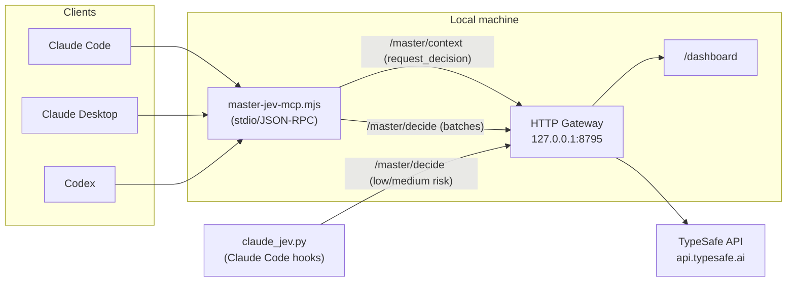
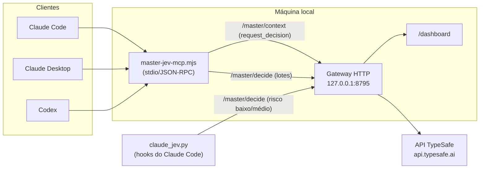

# Master-JEV Hook

**[English](#english)** | **[Português (Brasil)](#português-brasil)**

---

## English

<a id="english"></a>

### What it is

Master-JEV Hook is a local service that connects Claude Code, Claude
Desktop and Codex to JEV, TypeSafe's decision engine, through an MCP server
(`master-jev-hook`). Instead of the agent deciding on its own between
explicit alternatives — which approach to follow, which source to use, which
next action to take, how to classify or score a batch of items — it delegates
the choice to JEV through a set of MCP tools, and the gateway logs every
query in a local dashboard.

The package has three pieces: the local HTTP gateway (`gateway/`, in
TypeScript/Node), which talks to the TypeSafe API; the stdio MCP adapter
(`gateway/bin/master-jev-mcp.mjs`), registered as the `master-jev-hook`
server in supported clients; and, only for Claude Code, a set of hooks
(`claude_jev.py`) that injects the orchestration rule into the session,
announces when JEV is queried and performs spot checks (risky Bash command,
completion without verification, what to preserve during a compaction),
always without blocking the session.

JEV decides between options the agent has already raised: it does not
generate text, does not prove facts on its own, and does not grant
permissions. Registering the MCP server also does not change the model's
inference endpoint — it is one more tool the agent can call, and the hooks
just reinforce when to call it.

### How it works



The client calls an MCP tool; the `master-jev-mcp.mjs` adapter translates
the call into an HTTP request to the local gateway; the gateway builds the
question for JEV (Choice, Score or Noul), queries the TypeSafe API and
returns the result. The MCP adapter does not store the API key — it stays
only in the gateway's environment.

#### MCP tools

| Tool | Route | Question sent to JEV | Use |
| --- | --- | --- | --- |
| `request_decision` | `/master/context` | Built by the gateway (goal + context with candidates, criterion, evidence, risk) | Choosing an approach, source or next action |
| `jev_classify` | `/master/decide` | One Choice per item (up to 32; 2 to 64 categories) | Labeling items in batch |
| `jev_verify` | `/master/decide` | Noul (probability of yes) | Checking whether a passage satisfies a condition |
| `jev_score` | `/master/decide` | One Score per criterion, with optional weights | Scoring risk, quality or urgency |
| `jev_rank` | `/master/decide` | One Score per candidate, with ranking | Triaging items before reading everything |

#### Confidence thresholds by risk

Each query reports the risk of the action (`risk`); the gateway
requires a minimum confidence for Choice or Score responses:

| Risk | Minimum confidence | When to use |
| --- | --- | --- |
| low (default) | 0.65 | Reading, triage, investigation order |
| medium | 0.80 | Reversible change, choice of approach |
| high | 0.90 | Irreversible, external, security-related action or one involving credentials |

Below the threshold, or on error, the gateway abstains — the response is not
used and the client proceeds with the local alternative, without repeating
the decision. Noul (used by `jev_verify`) is a probability of "yes", not
a confidence, and has its own threshold. No JEV result proves facts or
grants permissions on its own.

#### Claude Code hooks

All hooks are fail-open: error, timeout, JEV abstention or confidence below
the threshold never blocks the session. The one exception is a command that
turns off the gateway: if the JEV answers that your request does not require
it, or abstains, the command is blocked (see the Bash row below).

| Event | What it does |
| --- | --- |
| `SessionStart` | Injects the orchestration rule into the session, if not already in `CLAUDE.md`; after compaction, reinjects what JEV marked as relevant |
| `UserPromptSubmit` | Short reminder of the rule on every message |
| `PreToolUse` (gateway tools) | Announces before each JEV query |
| `PostToolUse` (gateway tools) | Announces the query result |
| `PreToolUse` (Bash) | If a local filter finds the command risky, asks JEV whether you need to be asked; asks you only when JEV is ≥ 0.80 sure the command is severe, irreversible and beyond what you asked, otherwise the normal permission flow applies. It sends your last 3 messages (redacted, truncated) as context, so commands you asked for run without questions. A command that turns off the `master-jev-hook` gateway (`systemctl` `stop`/`disable`/`mask`/`kill`) is checked against your request: if your request requires it, it runs; otherwise it is blocked with a reason to the agent. You are never asked about it, and the gate never allows a command on its own |
| `Stop` | If there was an edit without verification afterward, asks JEV; alerts the agent, at most three times per session |
| `PreCompact` | Asks JEV, message by message, what is worth preserving before compacting |
| `PostToolUse` (all tools) | Every 15 tool calls, asks JEV whether the session is still on track, stuck, or has drifted out of scope |

#### Dashboard

The local dashboard, at `http://127.0.0.1:8795/dashboard`, lists the calls
to JEV: route, tokens reported, latency, decision, question and sanitized
result. Every query made by the MCP and by the hooks appears there. Without
the `JEV_LOG_FILE` variable, the history stays only in memory and is lost on
every gateway restart.

### Prerequisites

- Linux or macOS. Native Windows needs Python 3.13+ (the installer uses
  `os.fchmod`); the simplest alternative is running everything inside WSL2,
  since the gateway build uses POSIX-style `rm`/`cp`.
- Node.js 22.15 or newer, with an absolute path accessible to the client
  that will run the MCP.
- pnpm 10.33.3 (set in `gateway/package.json`). Without pnpm installed
  globally, use `npm exec --yes --package=pnpm@10.33.3 -- pnpm <command>`.
- Python 3.11 or newer, using only the standard library.
- Your own TypeSafe API key.
- Claude Code, Claude Desktop and/or Codex already installed on the desired
  targets.

### Installation

#### 1. Clone the repository

```bash
git clone https://github.com/sophia-phillipa/master-jev-hook.git
```

#### 2. Build the gateway

```bash
cd master-jev-hook/gateway
```

```bash
pnpm install --frozen-lockfile --ignore-scripts
```

```bash
pnpm typecheck
```

```bash
pnpm build
```

This generates `gateway/dist/` from the code in `gateway/src/`. None of
these commands queries the TypeSafe API.

#### 3. Create the private environment file

The file with the key lives outside the repository, in mode 600:

```bash
cd ..
```

```bash
umask 077; mkdir -p ~/.config/master-jev-hook ~/.local/state/master-jev-hook
```

```bash
umask 077; set -C; cp deploy/gateway.env.example ~/.config/master-jev-hook/gateway.env
```

```bash
chmod 600 ~/.config/master-jev-hook/gateway.env
```

Edit `~/.config/master-jev-hook/gateway.env` to fill in `TYPESAFE_API_KEY`
and the absolute path of `JEV_LOG_FILE` (never paste the key into chat, the
shell history, or a commit). The gateway reads this file with
`node --env-file`, so do not `source` it.

Main variables (see `gateway/.env.example` for the full list):

| Variable | Default | Function |
| --- | --- | --- |
| `TYPESAFE_API_KEY` | (required) | TypeSafe API key |
| `HOST` | `127.0.0.1` | Gateway interface (loopback by default; any other address is refused without `ROUTER_API_KEY`) |
| `PORT` | `8795` | Gateway and dashboard HTTP port |
| `JEV_MODEL` | `jev-latest` | JEV model (code default for the TypeSafe provider; `deploy/gateway.env.example` pins `jev-1.13.0`) |
| `JEV_MIN_CONFIDENCE` | `0.65` | Minimum confidence for low risk |
| `JEV_MIN_CONFIDENCE_MEDIUM` | `0.80` | Minimum confidence for medium risk |
| `JEV_MIN_CONFIDENCE_HIGH` | `0.90` | Minimum confidence for high risk |
| `JEV_DIRECT_CALLS` | `false` | Answer without calling JEV when the arguments are already certain |
| `JEV_CONTEXT_ROUTING` | `true` | Enables the `/master/context` route |
| `JEV_INSPECT_INPUTS` | `false` | Keeps local copies of the inputs sent to JEV (may contain private data) |
| `JEV_LOG_FILE` | (empty) | Absolute path of the log; without it, the dashboard history does not survive a restart |
| `ROUTER_API_KEY` | (empty) | Key clients must send (`Authorization: Bearer …`); required for a non-loopback `HOST`, and requires `UPSTREAM_API_KEY` |
| `MASTER_JEV_GATEWAY_KEY` | (empty) | Client side, not in `gateway.env`: the `ROUTER_API_KEY` value the MCP server and the Claude Code hooks send to the gateway |

#### 4. Run the gateway as a Linux user systemd service

Copy the service template, replacing `@REPO@` with the absolute path of the
checkout and `@NODE@` with the absolute path of Node
(`readlink -f "$(command -v node)"`):

```bash
mkdir -p ~/.config/systemd/user
```

```bash
sed -e "s|@REPO@|$(pwd)|" -e "s|@NODE@|$(readlink -f "$(command -v node)")|" deploy/master-jev-hook.service > ~/.config/systemd/user/master-jev-hook.service
```

```bash
systemctl --user daemon-reload
```

```bash
systemctl --user enable --now master-jev-hook.service
```

```bash
curl -s http://127.0.0.1:8795/health
```

On macOS, use an equivalent `LaunchAgent` (not covered by this repository).
If port `8795` is already in use, pick another free one and update it
consistently in the service (`PORT` in `gateway.env`), the installer
(`--gateway-url`) and any hook already configured. `scripts/verify.sh` no
longer uses a fixed port: it reads the URL recorded by the installer in
`PREFIX/claude_jev.json` (`gateway_url` field, `PREFIX` following the same
`~/.local/share/master-jev-hook` pattern; every target keeps it current,
except that another target never overwrites the file written by the
`claude-code` target, whose hooks use it), unless the
`MASTER_JEV_GATEWAY_URL` environment variable is set, which takes priority
over the file.

#### 5. Install on the clients

```bash
python3 install.py --dry-run
```

`--dry-run` shows the plan without writing anything. After checking it:

```bash
python3 install.py --target all
```

`--target` accepts `claude-code`, `claude-desktop`, `codex` or `all`
(default). With `all`, a missing client is skipped with a warning; an
explicit target installs anyway. Other useful options: `--node`,
`--gateway-url`, `--claude-home`, `--code-config`, `--desktop-config`,
`--codex-home`, `--prefix` (default `~/.local/share/master-jev-hook`). The
whole plan is validated before any write; the installation is idempotent
and backs up what it replaces.

With the `CLAUDE_CONFIG_DIR` environment variable set, `install.py` writes
`settings.json`, `CLAUDE.md`, `skills/` and `.claude.json` directly to
`$CLAUDE_CONFIG_DIR` (including as the default for `--claude-home`), instead
of `~/.claude` and `~/.claude.json`.

After installing, restart the clients — sessions already open do not
receive the new instructions. In Claude Code, `/mcp` lists the
`master-jev-hook` server and `/hooks` shows the installed hooks.

#### 6. Verify, at no cost

```bash
scripts/verify.sh
```

The script checks the gateway, the installed files and the configuration of
each client present, without making any paid API call.

#### 7. Open the dashboard

```bash
curl -s http://127.0.0.1:8795/dashboard > /dev/null && echo "dashboard at http://127.0.0.1:8795/dashboard"
```

Or open `http://127.0.0.1:8795/dashboard` directly in the browser.

### Claude Desktop (Chat mode)

In Chat mode, Claude Desktop sees the MCP server, but does not read
`CLAUDE.md` nor run the Claude Code hooks. For the same level of
instruction in this mode, the installer generates two files in the
installation prefix:

- `master-jev-hook-claude-chat.md`: instructions equivalent to Claude
  Code's, in plain text, to paste as an app or project instruction.
- `master-jev-hook-skill.zip`: the packaged `master-jev-hook` skill, to
  upload under Settings → Capabilities → Skills.

### Codex

`install.py` writes, between managed markers, two blocks:

- In `$CODEX_HOME/config.toml`, between `# master-jev-hook:begin` and
  `# master-jev-hook:end`: the `[mcp_servers.master-jev-hook]` section, with
  the Node command, the adapter path and `MASTER_JEV_GATEWAY_URL` in the
  environment.
- In `$CODEX_HOME/AGENTS.md`, between `<!-- master-jev-hook:begin -->` and
  `<!-- master-jev-hook:end -->`: the orchestration rule for Codex.

`$CODEX_HOME` follows the `CODEX_HOME` environment variable, defaulting to
`~/.codex`.

### Optional proxy mode

Besides responding to MCP tools and hooks, the same gateway can act as a
proxy for the LLM traffic of the `gateway/bin` launchers
(`master-jev-codex`, `master-jev-claude`, `master-jev-gemini`,
`master-jev-opencode`): each one brings up a local gateway and points the
client at it, which routes tool choice through JEV and forwards the rest of
the request to the real provider. It is in this mode that the
`UPSTREAM_BASE_URL`/`UPSTREAM_API_KEY` variables come in (and the
launcher-specific ones, like `JEV_CODEX_UPSTREAM_BASE_URL`), along with the
`upstream` field returned by `GET /health`. Normal use through MCP and hooks
(Claude Code, Claude Desktop, Codex configured by `install.py`) does not
depend on this mode.

### Privacy and costs

Each query to JEV — via the MCP tools or via the hooks — is a paid call to
the TypeSafe API. Installation itself (cloning, building, running
`install.py --dry-run` or `scripts/verify.sh`) makes no paid query; the
cost starts when a client actually calls an MCP tool or a decision hook
fires.

What each path sends to JEV (the API key never leaves the gateway process):

- **MCP tools:** exactly the arguments the agent passes (objective,
  candidates, criterion, evidence, items, state, risk).
- **Bash gate** (only for commands on the risky-command list): the command
  (up to 4,000 characters), the working directory, the agent's description
  of the command and your last 3 messages (redacted, up to 700 characters
  each). Commands that turn off the `master-jev-hook` gateway send the same,
  without the working directory.
- **Stop check** (only after a turn that edited files without running
  tests): the user's last request (up to 2,000 characters), the edited file
  paths, the commands run after the last edit and the agent's final message
  (up to 3,000 characters).
- **Compaction** (PreCompact): up to 32 of the user's own messages from the
  transcript (up to 1,500 characters each).
- **Drift detector** (every 15 tool calls): the user's last request and, for
  the latest tool calls, only the tool name and its file path or command —
  never file contents or edit strings.

Before sending, the hooks mask obvious secrets on a best-effort basis:
credentials in URLs (`https://user:token@…`), `Bearer` tokens and
`Authorization: Basic|Token|Digest …` credentials, the values of
`--password`, `--token`, `--api-key` and `--secret`, `-p` for the
mysql/mariadb family and `sshpass`, `-u user:password`, well-known token
formats (`sk-…`, `ghp_…`, `github_pat_…`, `AKIA…`, `xox…-…`), and
`KEY=VALUE` and `"key": "value"` pairs whose name contains key, token,
secret, password, passwd, auth or credential. Values are masked before any
truncation. This is pattern matching, not a guarantee: a secret in another
shape inside a prompt, command or message can still reach the API.
`JEV_INSPECT_INPUTS` and
`JEV_DEBUG_DUMP_DIR`, both off by default, keep local copies of the inputs
sent for debugging; since they may contain free text with private data,
keep them off outside of a specific investigation. Never paste secrets
(keys, passwords, tokens) into a question or context sent to JEV.

### Uninstall / restore backup

Every installation that changes something writes a backup to
`PREFIX/backups/<timestamp>/`, with the previous content of each touched
file and a `restore.json` (`backup: null` indicates a file created by that
installation, not a replaced file). To restore, close the clients and copy
back only the desired destinations from that backup, deleting the ones that
had `backup: null`.

To uninstall manually (if the installation used `CLAUDE_CONFIG_DIR`,
replace `~/.claude` and `~/.claude.json` below with `$CLAUDE_CONFIG_DIR` and
`$CLAUDE_CONFIG_DIR/.claude.json`, respectively):

- Remove the `mcpServers.master-jev-hook` entry from `~/.claude.json` and
  from `claude_desktop_config.json`.
- Remove the hooks whose command contains `PREFIX/claude_jev.py` in
  `~/.claude/settings.json`.
- Remove the `master-jev-hook-claude` block from `~/.claude/CLAUDE.md` and
  the `~/.claude/skills/master-jev-hook/` folder.
- Remove the `# master-jev-hook:begin`/`# master-jev-hook:end` block from
  `$CODEX_HOME/config.toml` and the `<!-- master-jev-hook:begin -->`/
  `<!-- master-jev-hook:end -->` block from `$CODEX_HOME/AGENTS.md`.
- Delete `PREFIX` (default `~/.local/share/master-jev-hook`).

For the gateway:

```bash
systemctl --user disable --now master-jev-hook.service
```

If you ask Claude to uninstall, the JEV sees your request and lets the
commands run; otherwise the Bash gate blocks them. Commands you type yourself
in a terminal are not affected by hooks.

Afterward, if you want, remove the unit and the
`~/.config/master-jev-hook/` and `~/.local/state/master-jev-hook/` folders.

### Development

Installer and hook tests (Python):

```bash
python3 -m unittest discover -s tests -v
```

Gateway tests and type checking (inside `gateway/`):

```bash
pnpm typecheck
```

```bash
pnpm test
```

#### Testing without a key (simulated JEV)

`gateway/scripts/mock-jev.mjs` is a local substitute for
`POST /v1/systemone`, to exercise the gateway end to end without a TypeSafe
key. Start it (default port 8789, adjustable with `MOCK_JEV_PORT`):

```bash
node gateway/scripts/mock-jev.mjs
```

Then, inside `gateway/`, point a test gateway at it with
`TYPESAFE_BASE_URL` (keeping `TYPESAFE_API_KEY` as any non-empty value, just
to pass validation). Use a different `PORT`, since the installed service
already occupies 8795:

```bash
TYPESAFE_API_KEY=mock TYPESAFE_BASE_URL=http://127.0.0.1:8789 PORT=8899 pnpm dev
```

For the MCP and the hooks to use this test gateway, install pointing at the
same port (preferably with a temporary `HOME`, so as not to change your
real installation):

```bash
python3 install.py --gateway-url http://127.0.0.1:8899
```

By default, the mock answers `request_decision` questions with confidence
`0.5` (`MOCK_JEV_ARG_CERTAINTY` variable, default `0.5`) — below the minimum
threshold (`0.65`), so JEV abstains and the decision is left to the local
alternative, as in production. To force a choice, start the mock with a
certainty above the threshold, for example:

```bash
MOCK_JEV_ARG_CERTAINTY=0.9 node gateway/scripts/mock-jev.mjs
```

Other mock variables: `MOCK_JEV_SCRIPT` (tool names to return in sequence,
for LLM client tool routing), `MOCK_JEV_CONFIDENCE` (confidence of the tool
choice, default `0.95`) and `MOCK_JEV_DUMP_DIR` (writes each question and
answer to disk, for debugging).

### License

Apache License 2.0 — see [LICENSE](LICENSE) and [NOTICE](NOTICE).
Third-party credits in [THIRD_PARTY_NOTICES.md](THIRD_PARTY_NOTICES.md).

---

## Português (Brasil)

<a id="português-brasil"></a>

### O que é

O Master-JEV Hook é um serviço local que conecta o Claude Code, o Claude
Desktop e o Codex ao JEV, o motor de decisão da TypeSafe, por um servidor MCP
(`master-jev-hook`). Em vez de o agente decidir sozinho entre alternativas
explícitas — qual abordagem seguir, qual fonte usar, qual próxima ação tomar,
como classificar ou pontuar um lote de itens — ele delega a escolha ao JEV por
um conjunto de ferramentas MCP, e o gateway registra cada consulta num painel
local.

O pacote tem três peças: o gateway HTTP local (`gateway/`, em TypeScript/Node),
que fala com a API da TypeSafe; o adaptador MCP stdio
(`gateway/bin/master-jev-mcp.mjs`), registrado como servidor `master-jev-hook`
nos clientes suportados; e, só no Claude Code, um conjunto de hooks
(`claude_jev.py`) que injeta a regra de orquestração na sessão, avisa quando o
JEV é consultado e faz verificações pontuais (comando arriscado no Bash,
conclusão sem verificação, o que preservar numa compactação), sempre sem
travar a sessão.

O JEV decide entre opções que o agente já levantou: ele não gera texto, não
prova fatos por conta própria e não concede permissões. Registrar o servidor
MCP também não muda o endpoint de inferência do modelo — é uma ferramenta a
mais que o agente pode chamar, e os hooks apenas reforçam quando chamá-la.

### Como funciona



O cliente chama uma ferramenta MCP; o adaptador `master-jev-mcp.mjs` traduz a
chamada em uma requisição HTTP ao gateway local; o gateway monta a pergunta
para o JEV (Choice, Score ou Noul), consulta a API da TypeSafe e devolve o
resultado. O adaptador MCP não guarda a chave da API — ela fica só no ambiente
do gateway.

#### Ferramentas MCP

| Ferramenta | Rota | Pergunta ao JEV | Uso |
| --- | --- | --- | --- |
| `request_decision` | `/master/context` | Montada pelo gateway (objetivo + contexto com candidatos, critério, evidência, risco) | Escolha de abordagem, fonte ou próxima ação |
| `jev_classify` | `/master/decide` | Uma Choice por item (até 32; 2 a 64 categorias) | Rotular itens em lote |
| `jev_verify` | `/master/decide` | Noul (probabilidade de sim) | Checar se um trecho satisfaz uma condição |
| `jev_score` | `/master/decide` | Uma Score por critério, com pesos opcionais | Pontuar risco, qualidade ou urgência |
| `jev_rank` | `/master/decide` | Uma Score por candidato, com ranking | Triar itens antes de ler tudo |

#### Limiares de confiança por risco

Cada consulta informa o risco da ação (`risk`); o gateway exige uma
confiança mínima em respostas do tipo Choice ou Score:

| Risco (`risk`) | Confiança mínima | Quando usar |
| --- | --- | --- |
| `low` (padrão) | 0.65 | Leitura, triagem, ordem de investigação |
| `medium` | 0.80 | Mudança reversível, escolha de abordagem |
| `high` | 0.90 | Ação irreversível, externa, de segurança ou com credenciais |

Abaixo do limiar, ou em caso de erro, o gateway abstém — a resposta não é
usada e o cliente segue com a alternativa local, sem repetir a decisão. Noul
(usado por `jev_verify`) é uma probabilidade de "sim", não uma confiança, e
tem limiar próprio. Nenhum resultado do JEV prova fatos nem concede permissões
por si só.

#### Hooks do Claude Code

Todos os hooks são fail-open: erro, timeout, abstenção do JEV ou confiança
abaixo do limiar nunca bloqueiam a sessão. A única exceção é um comando que
desliga o gateway: se o JEV responder que o seu pedido não exige isso, ou se
abstiver, o comando é bloqueado (veja a linha do Bash abaixo).

| Evento | O que faz |
| --- | --- |
| `SessionStart` | Injeta a regra de orquestração na sessão, se ainda não estiver no `CLAUDE.md`; após compactação, reinjeta o que o JEV marcou como relevante |
| `UserPromptSubmit` | Lembrete curto da regra a cada mensagem |
| `PreToolUse` (ferramentas do gateway) | Avisa antes de cada consulta ao JEV |
| `PostToolUse` (ferramentas do gateway) | Avisa o resultado da consulta |
| `PreToolUse` (Bash) | Se um filtro local achar o comando arriscado, pergunta ao JEV se você precisa ser consultado; só pede sua confirmação quando o JEV tem certeza ≥ 0,80 de que o comando é grave, irreversível e vai além do que você pediu, senão vale o fluxo normal de permissões. Envia suas 3 últimas mensagens (com segredos mascarados e truncadas) como contexto, para que comandos que você pediu rodem sem perguntas. Um comando que desliga o gateway `master-jev-hook` (`systemctl` `stop`/`disable`/`mask`/`kill`) é conferido com o seu pedido: se o pedido exige isso, ele roda; senão, é bloqueado com um motivo para o agente. Você nunca é consultado sobre isso, e o portão nunca libera um comando por conta própria |
| `Stop` | Se houve edição sem verificação depois, pergunta ao JEV; alerta o agente, no máximo três vezes por sessão |
| `PreCompact` | Pergunta ao JEV, mensagem a mensagem, o que vale a pena preservar antes de compactar |
| `PostToolUse` (todas as ferramentas) | A cada 15 ferramentas, pergunta ao JEV se a sessão segue no rumo, travou ou saiu do escopo |

#### Painel

O painel local, em `http://127.0.0.1:8795/dashboard`, lista as chamadas ao
JEV: rota, tokens informados, latência, decisão, pergunta e resultado
sanitizado. Toda consulta feita pelo MCP e pelos hooks aparece ali. Sem a
variável `JEV_LOG_FILE`, o histórico fica só em memória e se perde a cada
reinício do gateway.

### Pré-requisitos

- Linux ou macOS. Windows nativo precisa de Python 3.13+ (o instalador usa
  `os.fchmod`); a alternativa mais simples é rodar tudo dentro do WSL2, já que
  o build do gateway usa `rm`/`cp` no estilo POSIX.
- Node.js 22.15 ou mais recente, com caminho absoluto acessível ao cliente que
  vai rodar o MCP.
- pnpm 10.33.3 (definido em `gateway/package.json`). Sem pnpm instalado
  globalmente, use `npm exec --yes --package=pnpm@10.33.3 -- pnpm <comando>`.
- Python 3.11 ou mais recente, só com a biblioteca padrão.
- Uma chave própria da API da TypeSafe.
- Claude Code, Claude Desktop e/ou Codex já instalados nos alvos desejados.

### Instalação

#### 1. Clonar o repositório

```bash
git clone https://github.com/sophia-phillipa/master-jev-hook.git
```

#### 2. Construir o gateway

```bash
cd master-jev-hook/gateway
```

```bash
pnpm install --frozen-lockfile --ignore-scripts
```

```bash
pnpm typecheck
```

```bash
pnpm build
```

Isso gera `gateway/dist/` a partir do código em `gateway/src/`. Nenhum desses
comandos consulta a API da TypeSafe.

#### 3. Criar o arquivo de ambiente privado

O arquivo com a chave fica fora do repositório, em modo 600:

```bash
cd ..
```

```bash
umask 077; mkdir -p ~/.config/master-jev-hook ~/.local/state/master-jev-hook
```

```bash
umask 077; set -C; cp deploy/gateway.env.example ~/.config/master-jev-hook/gateway.env
```

```bash
chmod 600 ~/.config/master-jev-hook/gateway.env
```

Edite `~/.config/master-jev-hook/gateway.env` para preencher
`TYPESAFE_API_KEY` e o caminho absoluto de `JEV_LOG_FILE` (nunca cole a chave
no chat, no histórico do shell ou num commit). O gateway lê esse arquivo com
`node --env-file`, então não use `source` nele.

Principais variáveis (veja `gateway/.env.example` para a lista
completa):

| Variável | Padrão | Função |
| --- | --- | --- |
| `TYPESAFE_API_KEY` | (obrigatória) | Chave da API da TypeSafe |
| `HOST` | `127.0.0.1` | Interface do gateway (loopback por padrão; qualquer outro endereço é recusado sem `ROUTER_API_KEY`) |
| `PORT` | `8795` | Porta HTTP do gateway e do painel |
| `JEV_MODEL` | `jev-latest` | Modelo do JEV (padrão do código para o provedor TypeSafe; `deploy/gateway.env.example` fixa `jev-1.13.0`) |
| `JEV_MIN_CONFIDENCE` | `0.65` | Confiança mínima do risco baixo |
| `JEV_MIN_CONFIDENCE_MEDIUM` | `0.80` | Confiança mínima do risco médio |
| `JEV_MIN_CONFIDENCE_HIGH` | `0.90` | Confiança mínima do risco alto |
| `JEV_DIRECT_CALLS` | `false` | Responder sem chamar o JEV quando os argumentos já são certos |
| `JEV_CONTEXT_ROUTING` | `true` | Habilita a rota `/master/context` |
| `JEV_INSPECT_INPUTS` | `false` | Guarda cópias locais das entradas enviadas ao JEV (pode conter dados privados) |
| `JEV_LOG_FILE` | (vazio) | Caminho absoluto do log; sem ele, o histórico do painel não sobrevive a um reinício |
| `ROUTER_API_KEY` | (vazio) | Chave que os clientes precisam enviar (`Authorization: Bearer …`); obrigatória para `HOST` fora do loopback e exige `UPSTREAM_API_KEY` |
| `MASTER_JEV_GATEWAY_KEY` | (vazio) | Lado do cliente, fora do `gateway.env`: o valor de `ROUTER_API_KEY` que o servidor MCP e os hooks do Claude Code enviam ao gateway |

#### 4. Subir o gateway como serviço systemd de usuário (Linux)

Copie o modelo de serviço, substituindo `@REPO@` pelo caminho absoluto do
checkout e `@NODE@` pelo caminho absoluto do Node (`readlink -f "$(command -v node)"`):

```bash
mkdir -p ~/.config/systemd/user
```

```bash
sed -e "s|@REPO@|$(pwd)|" -e "s|@NODE@|$(readlink -f "$(command -v node)")|" deploy/master-jev-hook.service > ~/.config/systemd/user/master-jev-hook.service
```

```bash
systemctl --user daemon-reload
```

```bash
systemctl --user enable --now master-jev-hook.service
```

```bash
curl -s http://127.0.0.1:8795/health
```

Em macOS, use um `LaunchAgent` equivalente (não coberto por este repositório).
Se a porta `8795` já estiver em uso, escolha outra livre e atualize junto o
serviço (`PORT` no `gateway.env`), o instalador (`--gateway-url`) e qualquer
hook já configurado. `scripts/verify.sh` não usa mais uma porta fixa: ele lê
a URL gravada pelo instalador em `PREFIX/claude_jev.json` (campo `gateway_url`,
`PREFIX` com o mesmo padrão `~/.local/share/master-jev-hook`; todo alvo o
mantém atualizado, exceto que outro alvo nunca sobrescreve o arquivo gravado
pelo alvo `claude-code`, cujos hooks o usam), a menos que a
variável de ambiente `MASTER_JEV_GATEWAY_URL` esteja definida, que tem
prioridade sobre o arquivo.

#### 5. Instalar nos clientes

```bash
python3 install.py --dry-run
```

O `--dry-run` mostra o plano sem escrever nada. Depois de conferir:

```bash
python3 install.py --target all
```

`--target` aceita `claude-code`, `claude-desktop`, `codex` ou `all` (padrão).
Com `all`, um cliente ausente é pulado com aviso; um alvo explícito instala
mesmo assim. Outras opções úteis: `--node`, `--gateway-url`, `--claude-home`,
`--code-config`, `--desktop-config`, `--codex-home`, `--prefix` (padrão
`~/.local/share/master-jev-hook`). O plano inteiro é validado antes de
qualquer escrita; a instalação é idempotente e faz backup do que substitui.

Com a variável de ambiente `CLAUDE_CONFIG_DIR` definida, `install.py` grava
`settings.json`, `CLAUDE.md`, `skills/` e `.claude.json` diretamente em
`$CLAUDE_CONFIG_DIR` (inclusive como padrão de `--claude-home`), em vez de
`~/.claude` e `~/.claude.json`.

Depois de instalar, reinicie os clientes — sessões já abertas não recebem as
instruções novas. No Claude Code, `/mcp` lista o servidor `master-jev-hook`
e `/hooks` mostra os hooks instalados.

#### 6. Verificar, sem custo

```bash
scripts/verify.sh
```

O script confere o gateway, os arquivos instalados e a configuração de cada
cliente presente, sem fazer nenhuma consulta paga à API.

#### 7. Abrir o painel

```bash
curl -s http://127.0.0.1:8795/dashboard > /dev/null && echo "painel em http://127.0.0.1:8795/dashboard"
```

Ou abra `http://127.0.0.1:8795/dashboard` diretamente no navegador.

### Claude Desktop (modo Chat)

No modo Chat, o Claude Desktop enxerga o servidor MCP, mas não lê o
`CLAUDE.md` nem roda os hooks do Claude Code. Para o mesmo nível de instrução
nesse modo, o instalador gera dois arquivos no prefixo de instalação:

- `master-jev-hook-claude-chat.md`: instruções equivalentes às do Claude Code,
  em texto simples, para colar como instrução do app ou do projeto.
- `master-jev-hook-skill.zip`: a skill `master-jev-hook` empacotada, para subir em
  Configurações → Capabilities → Skills.

### Codex

O `install.py` escreve, entre marcadores gerenciados, dois blocos:

- Em `$CODEX_HOME/config.toml`, entre `# master-jev-hook:begin` e
  `# master-jev-hook:end`: a seção `[mcp_servers.master-jev-hook]`, com o
  comando do Node, o caminho do adaptador e `MASTER_JEV_GATEWAY_URL` no
  ambiente.
- Em `$CODEX_HOME/AGENTS.md`, entre `<!-- master-jev-hook:begin -->` e
  `<!-- master-jev-hook:end -->`: a regra de orquestração para o Codex.

`$CODEX_HOME` segue a variável de ambiente `CODEX_HOME`, com `~/.codex` como
padrão.

### Modo proxy opcional

Além de responder às ferramentas MCP e aos hooks, o mesmo gateway pode atuar
como proxy do tráfego de LLM dos lançadores `gateway/bin` (`master-jev-codex`,
`master-jev-claude`, `master-jev-gemini`, `master-jev-opencode`): cada um sobe
um gateway local e aponta o cliente para ele, que roteia a escolha de
ferramentas pelo JEV e encaminha o resto do pedido ao provedor real. É nesse
modo que entram as variáveis `UPSTREAM_BASE_URL`/`UPSTREAM_API_KEY` (e as
específicas de cada lançador, como `JEV_CODEX_UPSTREAM_BASE_URL`) e o campo
`upstream` devolvido por `GET /health`. O uso normal via MCP e hooks (Claude
Code, Claude Desktop, Codex configurados por `install.py`) não depende desse
modo.

### Privacidade e custos

Cada consulta ao JEV — pelas ferramentas MCP ou pelos hooks — é uma chamada
paga à API da TypeSafe. A instalação em si (clonar, construir, rodar
`install.py --dry-run` ou `scripts/verify.sh`) não faz nenhuma consulta
paga; o custo começa quando um cliente chama de fato uma ferramenta MCP ou um
hook de decisão dispara.

O que cada caminho envia ao JEV (a chave da API nunca sai do processo do
gateway):

- **Ferramentas MCP:** exatamente os argumentos que o agente passa (objetivo,
  candidatos, critério, evidências, itens, estado, risco).
- **Portão de Bash** (só para comandos da lista de comandos arriscados): o
  comando (até 4.000 caracteres), o diretório de trabalho, a descrição do
  comando feita pelo agente e suas 3 últimas mensagens (com segredos
  mascarados, até 700 caracteres cada). Comandos que desligam o gateway
  `master-jev-hook` enviam o mesmo, sem o diretório de trabalho.
- **Verificação no Stop** (só depois de um turno que editou arquivos sem
  rodar testes): o último pedido do usuário (até 2.000 caracteres), os
  caminhos dos arquivos editados, os comandos rodados depois da última edição
  e a mensagem final do agente (até 3.000 caracteres).
- **Compactação** (PreCompact): até 32 mensagens do próprio usuário na
  transcrição (até 1.500 caracteres cada).
- **Detector de desvio** (a cada 15 chamadas de ferramenta): o último pedido
  do usuário e, das chamadas mais recentes, só o nome da ferramenta e o
  caminho do arquivo ou o comando — nunca o conteúdo de arquivos nem os
  trechos de edição.

Antes de enviar, os hooks mascaram segredos óbvios, em regime de melhor
esforço: credenciais em URLs (`https://usuario:token@…`), tokens `Bearer`
e credenciais `Authorization: Basic|Token|Digest …`, os valores de
`--password`, `--token`, `--api-key` e `--secret`, `-p` da família
mysql/mariadb e do `sshpass`, `-u usuario:senha`, formatos de token
conhecidos (`sk-…`, `ghp_…`, `github_pat_…`, `AKIA…`, `xox…-…`), e pares
`CHAVE=VALOR` e `"chave": "valor"` cujo nome contém key, token, secret,
password, passwd, auth ou credential. Os valores são mascarados antes de
qualquer truncamento. É casamento de padrões, não garantia: um segredo em
outro formato dentro de um pedido, comando ou mensagem ainda pode chegar à
API.
`JEV_INSPECT_INPUTS` e
`JEV_DEBUG_DUMP_DIR`, ambos desligados por padrão, guardam cópias locais das
entradas enviadas para depuração; como podem conter texto livre com dados
privados, mantenha-os desligados fora de investigação pontual. Nunca cole
segredos (chaves, senhas, tokens) em uma pergunta ou contexto enviado ao JEV.

### Desinstalar / restaurar backup

Cada instalação que altera algo grava um backup em
`PREFIX/backups/<timestamp>/`, com o conteúdo anterior de cada arquivo tocado
e um `restore.json` (`backup: null` indica um arquivo criado por aquela
instalação, não um arquivo substituído). Para restaurar, feche os clientes e
copie de volta apenas os destinos desejados a partir desse backup, apagando os
que tinham `backup: null`.

Para desinstalar manualmente (se a instalação usou `CLAUDE_CONFIG_DIR`, troque
`~/.claude` e `~/.claude.json` abaixo por `$CLAUDE_CONFIG_DIR` e
`$CLAUDE_CONFIG_DIR/.claude.json`, respectivamente):

- Remova a entrada `mcpServers.master-jev-hook` de `~/.claude.json` e de
  `claude_desktop_config.json`.
- Remova os hooks cujo comando contém `PREFIX/claude_jev.py` em
  `~/.claude/settings.json`.
- Remova o bloco `master-jev-hook-claude` do `~/.claude/CLAUDE.md` e a pasta
  `~/.claude/skills/master-jev-hook/`.
- Remova o bloco `# master-jev-hook:begin`/`# master-jev-hook:end` de
  `$CODEX_HOME/config.toml` e o bloco `<!-- master-jev-hook:begin -->`/
  `<!-- master-jev-hook:end -->` de `$CODEX_HOME/AGENTS.md`.
- Apague o `PREFIX` (padrão `~/.local/share/master-jev-hook`).

Para o gateway:

```bash
systemctl --user disable --now master-jev-hook.service
```

Se você pedir ao Claude para desinstalar, o JEV vê o seu pedido e deixa os
comandos rodarem; caso contrário, o portão de Bash os bloqueia. Comandos que
você mesmo digita num terminal não são afetados pelos hooks.

Depois, se quiser, remova a unit e as pastas
`~/.config/master-jev-hook/` e `~/.local/state/master-jev-hook/`.

### Desenvolvimento

Testes do instalador e dos hooks (Python):

```bash
python3 -m unittest discover -s tests -v
```

Testes e checagem de tipos do gateway (dentro de `gateway/`):

```bash
pnpm typecheck
```

```bash
pnpm test
```

#### Testar sem chave (JEV simulado)

`gateway/scripts/mock-jev.mjs` é um substituto local de `POST /v1/systemone`,
para exercitar o gateway de ponta a ponta sem uma chave da TypeSafe. Suba-o
(porta padrão 8789, ajustável com `MOCK_JEV_PORT`):

```bash
node gateway/scripts/mock-jev.mjs
```

Depois, dentro de `gateway/`, aponte um gateway de teste para ele com
`TYPESAFE_BASE_URL` (mantendo `TYPESAFE_API_KEY` como qualquer valor não vazio,
só para passar na validação). Use outra `PORT`, porque o serviço instalado já
ocupa a 8795:

```bash
TYPESAFE_API_KEY=mock TYPESAFE_BASE_URL=http://127.0.0.1:8789 PORT=8899 pnpm dev
```

Para que o MCP e os hooks usem esse gateway de teste, instale apontando para a
mesma porta (de preferência com um `HOME` temporário, para não alterar a sua
instalação real):

```bash
python3 install.py --gateway-url http://127.0.0.1:8899
```

No padrão, o mock responde às perguntas de `request_decision` com confiança
`0.5` (variável `MOCK_JEV_ARG_CERTAINTY`, padrão `0.5`) — abaixo do limiar
mínimo (`0.65`), então o JEV se abstém e a decisão fica por conta da
alternativa local, como em produção. Para forçar uma escolha, suba o mock com
uma certeza acima do limiar, por exemplo:

```bash
MOCK_JEV_ARG_CERTAINTY=0.9 node gateway/scripts/mock-jev.mjs
```

Outras variáveis do mock: `MOCK_JEV_SCRIPT` (nomes de ferramenta a devolver em
sequência, para roteamento de ferramentas de clientes LLM), `MOCK_JEV_CONFIDENCE`
(confiança da escolha de ferramenta, padrão `0.95`) e `MOCK_JEV_DUMP_DIR`
(grava cada pergunta e resposta em disco, para depuração).

### Licença

Apache License 2.0 — veja [LICENSE](LICENSE) e [NOTICE](NOTICE). Créditos de
terceiros em [THIRD_PARTY_NOTICES.md](THIRD_PARTY_NOTICES.md).
